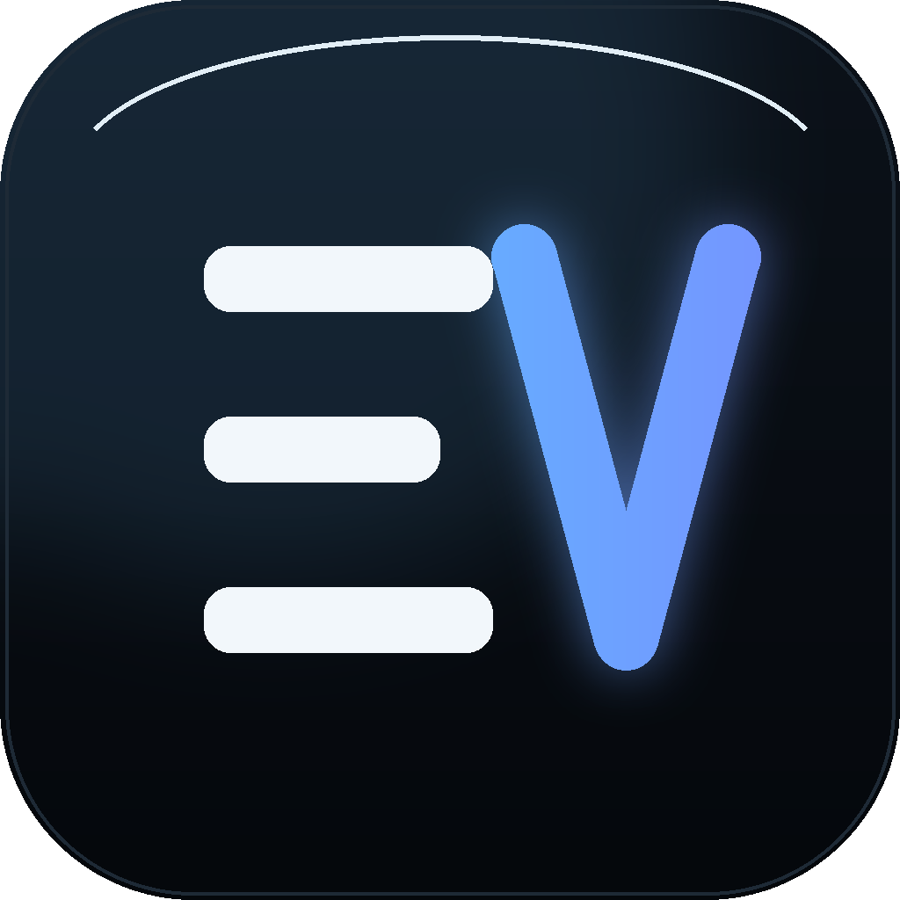

<p align="center">
  
</p>

<h1 align="center">E.V. — Personal AI Assistant</h1>

<p align="center">
  <strong>A Windows desktop assistant for voice, automation, documents and browsing.</strong><br />
  Quiet by default, tool-driven, and honest about what it did.
</p>

<p align="center">
  <a href="#overview"></a>
  <a href="#installation"></a>
  <a href="#architecture"></a>
</p>

---

## Overview

E.V. is a desktop assistant that runs on your own machine. It listens (or takes
typed input), plans the work, calls real tools to do it, and reports the outcome
in plain language.

- Live voice and text conversation through Gemini, with OpenRouter as a fallback
- A dashboard that shows the greeting, system state, running tasks, recent
  conversations and connected services at a glance
- Tool activity cards that track each step: Pending → Running → Completed/Failed
- Windows automation for apps, windows, files, keyboard, mouse and screenshots
- Browser automation through Playwright, with real page-level feedback
- Document generation: PowerPoint, Word, spreadsheets and PDF
- Memory of the facts you tell it, reviewable and editable
- Discord bridge, mobile remote, reminders, meeting prompts and a daily briefing

## Features

### Conversation

- Streaming answers with markdown, headings, lists, quotes and syntax-highlighted
  code blocks (Python, JavaScript/TypeScript, JSON, bash, PowerShell, HTML, CSS)
- Code blocks and replies have working copy controls, plus full-reply copy
- Tool indicators, thinking state, and an error card with **Retry** and
  **Details** instead of a raw stack trace
- File attachments for images, documents, spreadsheets, code, audio and archives
- Voice replies; the orb reflects Listening / Thinking / Working / Speaking /
  Muted instead of faking activity

### Tasks and tools

Each request becomes a task in the right-hand panel: a short plan, the stage flow
(Request → Planning → Executing → Verifying → Completed), and one card per tool
call with its status, detail line and elapsed time.

Available tool groups:

| Group | What it covers |
| --- | --- |
| System | Open apps, windows, volume, brightness, power, clipboard, screenshots |
| Files | Search, move, copy, rename, organise folders, read and write text |
| Office | Presentations, spreadsheets, Word documents, PDF export |
| Browser | Playwright navigation, clicking, typing, forms, tabs, history, search |
| Web | Web search, weather, flights, YouTube playback |
| Screen | Screen and webcam analysis, focused-window questions |
| Smart home | Devices added to Home Control, grouped by room |
| Communication | Discord bridge, messages, reminders, meeting prompts |
| Memory | Save and recall personal facts locally |

### Voice

- Push-to-talk with **F4**, or continuous listening with a wake phrase
- Microphone mute with a visible state everywhere it matters
- Focus-aware: audio from other apps can duck E.V.'s voice, and it stops
  speaking when you interrupt
- Optional compact waveform, driven by the real input envelope

### Browser and Windows automation

- Playwright drives a real browser: navigation, clicks, typing, scrolling,
  downloads, tab management and screenshots all report what actually happened
- Windows automation covers keyboard and mouse control, window focus, hotkeys,
  application launching and desktop file management
- Irreversible actions always ask for confirmation before running

## Architecture

```
main.py              app entry point, AI session, audio pipeline, command routing
ui.py                the whole interface: window, dashboard, chat panel, overlay
EVLive               live session: prompts, tool calls, audio in/out, fallbacks
actions/             one module per tool group (browser, office, files, ...)
agent/               task planning and execution helpers
memory/              long-term personal memory store
workspace_store.py   conversation and memory persistence (SQLite)
or_client.py         OpenRouter fallback client
discord_bot.py       Discord bridge
smart_home_page.py   Home Control page for smart-home devices
dashboard/           optional local web dashboard
plugins/             drop-in Python plugins
tools/               developer utilities (previews, assets, headless helpers)
```

Design rules the code follows:

- The interface never claims a tool ran unless the tool reported it
- Errors surface as one calm sentence with an actionable next step
- API keys and tokens live in `config/*.json`, which are git-ignored

## Installation

### Prerequisites

- Windows 10 or 11
- Python 3.11 or 3.12
- Git
- A Gemini API key (required) and an OpenRouter key (optional fallback)

### 1. Get the code

```powershell
git clone https://github.com/Avyansh-AI/E.V.git
cd E.V
```

### 2. Virtual environment

```powershell
python -m venv .venv
.\.venv\Scripts\Activate.ps1
```

### 3. Dependencies

```powershell
pip install -r requirements.txt
playwright install          # browser automation
```

`setup.py` performs both steps when you prefer a single command.

### 4. First run

```powershell
python main.py
```

The setup card asks for your API keys the first time. To configure them by hand,
create `config/api_keys.json`:

```json
{
  "gemini_api_key": "YOUR_GEMINI_API_KEY",
  "openrouter_api_key": "YOUR_OPENROUTER_API_KEY"
}
```

`start_ev.vbs` launches without a console window, and
`config\create_desktop_shortcut.ps1` adds a desktop shortcut (it derives every
path from its own location, so it works from any install folder).

## Configuration

| File | Purpose |
| --- | --- |
| `config/api_keys.json` | Gemini and OpenRouter keys. Git-ignored, never logged |
| `config/app_settings.json` | Startup, provider, voice and prompt preferences |
| `config/discord_bot.json` | Discord bridge token and channel |
| `config/firebase_config.json` | Optional dashboard credentials — replace the placeholders or copy `firebase_config.sample.json` |

Settings are also editable in the app: **Settings → General / AI / Voice /
Automation / Integrations / Advanced**. Keys are shown masked, and there is no
plaintext key anywhere in the interface.

## AI providers

- **Gemini 2.5 Flash** (live audio + text) is the primary provider.
- **OpenRouter** takes over when Gemini is unavailable or rate limited. Model
  failover is automatic and can be disabled in Settings → AI.
- Provider status, the active model, and a connection test are all shown in the
  same place, so "AI ready" always reflects a real check.

## Voice setup

- Default voice: Gemini "Charon" for spoken replies, with local TTS as backup
- Input 16 kHz, output 24 kHz, 1024-sample chunks for low latency
- **F4** toggles the microphone, **F11** fullscreen, **Ctrl+[** and **Ctrl+]**
  collapse the left and right rails

## Browser automation

Playwright must be installed (`playwright install`) for browsing tools. E.V.
reports the real browser state — page title, URL, element found or not — rather
than assuming success, and never claims a click happened if the page did not
change.

## Windows automation

Keyboard, mouse, window focus, hotkeys, app launching, screenshots, power
actions and file operations use native Windows APIs. Anything destructive
(deleting files, closing unsaved work, sending messages) asks first.

## Integrations

- **Discord** — mirror the conversation to a server channel, restricted to the
  configured channel ID
- **Mobile connect** — scan the QR code to send commands from your phone
- **Smart home** — devices registered in Home Control, grouped by room
- **Firebase dashboard** — optional local web dashboard (`dashboard/server.py`)

## Plugins

Drop a `.py` file into `plugins/` exporting any of:

- `on_ev_created(ev)` — called when the `EVLive` instance is created
- `on_startup(ev)` — called once after plugins are registered
- `on_text_command(text, source, ev=None)` — return `True` to handle the command

`plugins/example_plugin.py` shows the pattern.

## Development

```powershell
python -m pytest tests            # gesture utility tests
python tools\ui_preview.py        # render interface screenshots
python tools\preview_server.py    # live browser preview of the real Qt window
python tools\make_brand_assets.py # regenerate logo, icon, wordmark
python tools\make_background.py   # regenerate assets/background.png
```

On a headless Linux machine, `tools/headless_qt/build_stubs.py` provides the
library stubs Qt's offscreen plugin needs; see
`tools/headless_qt/README.md`.

### Project layout for contributors

- `ui.py` holds the design tokens (`EV`), the global stylesheet (`EV_QSS`),
  log parsing (`parse_log_line`) and error wording (`humanize_error`)
- Tool modules in `actions/` are independent of the interface and can be tested
  directly
- Conversation state lives in `workspace_store.py`; nothing else writes to it

## Troubleshooting

| Symptom | Fix |
| --- | --- |
| "Setup required" every launch | `config/api_keys.json` is missing or has an empty `gemini_api_key` |
| Browser tools report an engine error | Run `playwright install` |
| No voice output | Check the Windows output device, then Settings → Voice |
| Microphone not detected | Allow microphone access for desktop apps in Windows privacy settings |
| Hand tracking shows a black preview | Another app is using the camera, or no camera is attached |
| Discord bot offline | Verify the bot token and channel ID in Settings → Integrations |
| Replies are slow or fall back to OpenRouter | Gemini quota reached; the fallback is automatic |
| Interface looks cramped | Collapse a side rail, or maximise — the dashboard scrolls on smaller screens |

## Community

- Discord: https://discord.gg/gEYmJKKtq3

## License

This project is licensed under a custom source-available license. See `LICENSE`
for full terms and `TRADEMARK.md` for branding details.

## Maintained by

- Suryaansh Tiwari

Please preserve attribution and keep credentials secure when building on top of
E.V.
